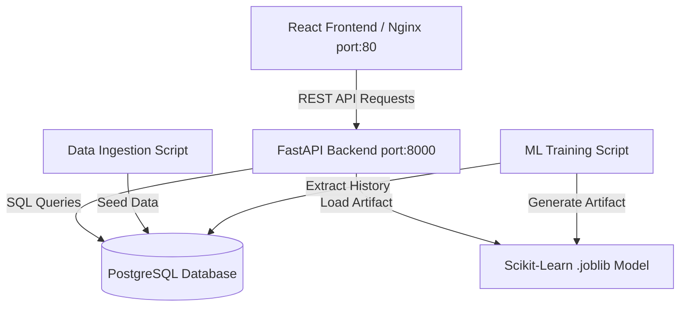

---

# 🚀 VANAD E-Commerce Analytics Dashboard

A full-stack, containerized analytics platform that transforms raw transactional data into **real-time business insights** and uses machine learning to **forecast future revenue**.

---

## 📌 The Problem

E-commerce platforms generate massive volumes of raw, sequential data (orders, customers, inventory). However:

* Raw SQL tables do **not provide actionable insights**
* Store owners lack **short-term revenue forecasting**
* Inventory and business decisions become **reactive instead of proactive**

---

## 💡 The Solution

This project delivers a unified, production-style architecture combining:

* **Data Engineering** → Structured data ingestion into PostgreSQL
* **Backend API Layer** → FastAPI serving aggregated KPIs
* **Frontend Dashboard** → React-based real-time visualization
* **Machine Learning Pipeline** → Revenue forecasting using Scikit-Learn

### 🔑 Key Features

* 📊 Real-time KPI analytics dashboard
* 🔄 Automated data ingestion pipeline
* 🤖 ML-based 7-step revenue forecasting
* 🐳 Fully containerized with Docker
* ⚡ High-performance API with FastAPI

---

## 🏗️ Architecture Diagram



---

## ⚙️ Challenges & Solutions

### 1. Docker Internal DNS Resolution

**Problem:**
FastAPI container failed to connect to PostgreSQL due to unreliable Docker service alias resolution (`db`).

**Solution:**

```bash
vanad-postgres
```

**Result:**
Stable and predictable networking across Docker containers.

---

### 2. Frontend Build Conflicts (CI/CD)

**Problem:**
Dependency conflicts between Vite and Tailwind CSS caused build failures.

**Solution:**

```bash
npm install --legacy-peer-deps
```

**Result:**
Successful and stable frontend builds.

---

### 3. CORS Restrictions

**Problem:**
Frontend requests were blocked after moving from:

```
localhost:5173 → Nginx (port 80)
```

**Solution:**
Updated FastAPI CORS middleware to allow the correct origin.

**Result:**
Smooth communication between frontend and backend.

---

## 🛠️ Tech Stack

### Frontend

* React
* Vite
* Tailwind CSS
* Recharts

### Backend

* FastAPI (Python)
* Uvicorn

### Database

* PostgreSQL
* psycopg2

### Machine Learning

* Scikit-Learn (Linear Regression)
* Pandas
* Joblib

### DevOps

* Docker
* Docker Compose
* GitHub Actions

---

## 🚀 How to Run Locally

### 1. Clone the Repository

```bash
git clone https://github.com/OFFICIAL-IBRAHIM-ASAD/ecommerce-analytics-dashboard.git
cd ecommerce-analytics-dashboard
```

---

### 2. Start Docker Containers

```bash
docker compose up -d
```

---

### 3. Generate Data & Train Model

```bash
source venv/bin/activate
python3 ingest_data.py
python3 train_model.py
```

---

### 4. Open the Dashboard

```
http://localhost
```

---

## 📈 Future Improvements

* Advanced ML models (LSTM, ARIMA)
* Real-time data streaming
* User authentication system
* Cloud deployment (AWS/GCP)

---

## 👨‍💻 Author

**Ibrahim Asad**
GitHub: [https://github.com/OFFICIAL-IBRAHIM-ASAD](https://github.com/OFFICIAL-IBRAHIM-ASAD)

---

## ⭐ Support

If you found this project useful:

* ⭐ Star the repository
* 🍴 Fork it
* 📢 Share it

---
